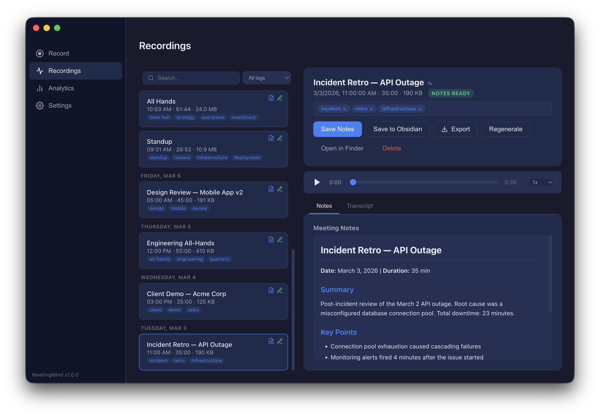

# MeetingMind

[](https://github.com/noahcoffey/MeetingMind/actions/workflows/test.yml)

A macOS desktop app for recording meetings, transcribing with AssemblyAI, and generating structured notes with Claude AI.



## Features

- **Audio Recording** — Chunked recording via ffmpeg with pause/resume, cancel & discard, and disk space monitoring
- **System Audio Capture** — Record both microphone and system audio using virtual audio devices (BlackHole, Loopback)
- **AI Transcription** — Multi-provider support: AssemblyAI, OpenAI Whisper, or Deepgram (speaker diarization included)
- **AI Meeting Notes** — Generate structured notes via Claude Code CLI (subscription) or Anthropic API (pay-per-call)
- **Meeting Q&A** — Ask Claude questions about any meeting with full transcript and notes as context; answers stream live and are saved for future reference
- **Custom Vocabulary** — Supply names and terms to improve transcription accuracy, with known misspelling variants
- **Inline Corrections** — Select text in notes to correct and automatically add to your vocabulary
- **Transcript Viewer** — Speaker-colored segments with click-to-seek audio sync and inline speaker renaming
- **Full-Text Search** — Search across titles, tags, notes, and transcripts with ranked results
- **Tags & AI Categorization** — Manual tagging plus automatic AI-suggested tags after notes generation
- **Export Options** — Copy to clipboard, export as PDF, or email notes to meeting attendees
- **Meeting Analytics** — Dashboard with weekly trends, per-day stats, top tags, and AI-generated trend insights
- **Calendar Integration** — Google Calendar, Microsoft 365, and ICS feed support for meeting context
- **Obsidian Integration** — Save notes directly to your Obsidian vault, with per-question Q&A export
- **Themes** — 8 built-in themes (Dark, Ember, Forest, Nord, Ocean, Slate, Violet, Light) plus system auto-detect
- **Global Hotkeys** — Start/stop recording from anywhere with customizable keyboard shortcuts
- **Menu Bar Tray** — Quick access controls without switching windows
- **Crash Recovery** — Automatic manifest checkpointing and disk space monitoring

## Tech Stack

- **Electron** + **React** + **TypeScript**
- **ffmpeg** (avfoundation) for audio capture and processing
- **AssemblyAI** / **OpenAI Whisper** / **Deepgram** for transcription
- **Claude AI** for notes generation and auto-tagging
- **electron-store** for settings persistence
- **keytar** for secure API key storage in macOS Keychain

## Getting Started

### Prerequisites

- Node.js 18+
- ffmpeg installed (`brew install ffmpeg`)
- An [AssemblyAI API key](https://assemblyai.com)
- Either [Claude Code CLI](https://docs.anthropic.com/en/docs/claude-code) (recommended) or an [Anthropic API key](https://console.anthropic.com)

### Install & Run

```bash
git clone https://github.com/noahcoffey/MeetingMind.git
cd MeetingMind
npm install
npm start
```

The app will guide you through setup on first launch.

### Development

```bash
# Build main process + renderer
npm run build

# Run tests
npm test

# Watch mode
npm run test:watch

# Package as .dmg
npm run package:dmg
```

## Project Structure

```
src/
├── main/                    # Electron main process
│   ├── main.ts              # App entry, window, tray, protocol handler
│   ├── ipc.ts               # IPC handler registration
│   ├── preload.ts           # Context bridge API
│   ├── recording-manager.ts # Chunked audio recording via ffmpeg
│   ├── transcription.ts     # AssemblyAI upload & polling
│   ├── notes-generator.ts   # Claude CLI/API notes generation
│   ├── search.ts            # Full-text search engine
│   ├── analytics.ts         # Meeting statistics & trend analysis
│   ├── tagger.ts            # AI auto-tagging & manual tags
│   ├── weekly-highlights.ts # Weekly highlights generation
│   ├── meeting-qa.ts        # Meeting Q&A with Claude + Obsidian sync
│   ├── export.ts            # Clipboard, PDF, email export
│   ├── calendar.ts          # Google, Microsoft, ICS calendar
│   ├── system-audio.ts      # Virtual audio device detection
│   ├── tray.ts              # Menu bar tray & context menu
│   ├── store.ts             # Settings persistence
│   └── logger.ts            # File logging
└── renderer/                # React frontend
    ├── App.tsx              # Root layout with sidebar navigation
    ├── pages/
    │   ├── RecordPage.tsx       # Recording UI with device picker
    │   ├── MeetingsPage.tsx      # Library list + detail panel + Q&A
    │   ├── AnalyticsPage.tsx    # Stats dashboard
    │   ├── HighlightsPage.tsx   # Weekly highlights
    │   ├── SettingsPage.tsx     # Settings shell with sub-pages
    │   └── settings/            # Settings sub-pages (General, Recording, AI, Vocabulary, Calendar, Obsidian)
    ├── components/
    │   ├── AudioPlayer.tsx      # Playback controls
    │   ├── TranscriptViewer.tsx # Speaker-colored transcript
    │   ├── SearchBar.tsx        # Debounced search with results
    │   ├── TagEditor.tsx        # Tag pills with autocomplete
    │   ├── MarkdownRenderer.tsx  # Markdown display with inline corrections
    │   ├── SpeakerPanel.tsx     # Speaker stats & renaming
    │   ├── ExportMenu.tsx       # Export action dropdown
    │   ├── PipelineWidget.tsx   # Background job status
    │   └── Sidebar.tsx          # Navigation sidebar
    └── hooks/
        └── useAudioPlayer.ts   # Shared audio playback hook
```

## Notes Provider

MeetingMind supports two modes for AI features (notes generation, Q&A, auto-tagging, trend insights):

- **CLI Mode** (default) — Uses your Claude Code CLI subscription. No per-call costs.
- **API Mode** — Uses the Anthropic API with your own API key. Pay-per-token.

Switch between modes in Settings.

## License

MIT
