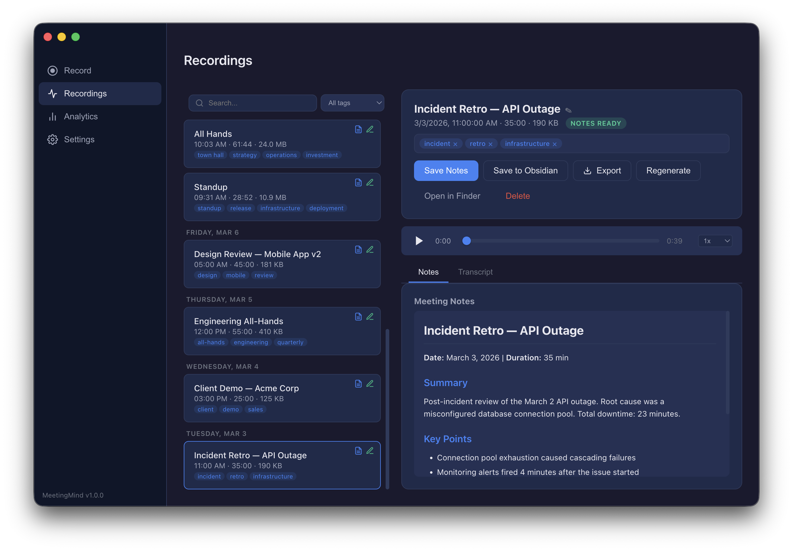

# MeetingMind

[](https://github.com/noahcoffey/MeetingMind/actions/workflows/test.yml)

A macOS desktop app for recording meetings, transcribing with AssemblyAI, and generating structured notes with Claude AI.



## Features

- **Audio Recording** — Chunked recording via ffmpeg with pause/resume, cancel & discard, and disk space monitoring
- **System Audio Capture** — Record both microphone and system audio using virtual audio devices (BlackHole, Loopback)
- **AI Transcription** — Multi-provider support: AssemblyAI, OpenAI Whisper, Deepgram, or **WhisperX Local** — free, on-device transcription with optional speaker diarization (no audio leaves your Mac)
- **AI Meeting Notes** — Generate structured notes via Claude Code CLI (subscription) or Anthropic API (pay-per-call)
- **Meeting Q&A** — Ask Claude questions about any meeting with full transcript and notes as context; answers stream live and are saved for future reference
- **Custom Vocabulary** — Supply names and terms to improve transcription accuracy, with known misspelling variants
- **Inline Corrections** — Select text in notes to correct and automatically add to your vocabulary
- **Transcript Viewer** — Speaker-colored segments with click-to-seek audio sync and inline speaker renaming
- **Full-Text Search** — Search across titles, tags, notes, and transcripts with ranked results
- **Tags & AI Categorization** — Manual tagging plus automatic AI-suggested tags after notes generation
- **Export Options** — Copy to clipboard, export as PDF, or email notes to meeting attendees
- **Meeting Analytics** — Dashboard with weekly trends, per-day stats, top tags, and AI-generated trend insights
- **Calendar Integration** — Google Calendar, Microsoft 365, and ICS feed support for meeting context
- **Obsidian Integration** — Save notes directly to your Obsidian vault, with per-question Q&A export
- **Weekly Highlights** — AI-generated digest of the week's meetings on a dedicated page
- **Themes** — 8 built-in themes (Dark, Ember, Forest, Nord, Ocean, Slate, Violet, Light) plus system auto-detect
- **Global Hotkeys** — Start/stop recording from anywhere with customizable keyboard shortcuts
- **Menu Bar Tray** — Quick access controls without switching windows
- **Crash Recovery** — Automatic manifest checkpointing and disk space monitoring

## Tech Stack

- **Electron** + **React** + **TypeScript**
- **ffmpeg** (avfoundation) for audio capture and processing
- **AssemblyAI** / **OpenAI Whisper** / **Deepgram** for cloud transcription
- **WhisperX** + **pyannote.audio** for free on-device transcription & diarization, run via a bundled Python interpreter
- **Claude AI** for notes generation and auto-tagging
- **electron-store** for settings persistence
- **keytar** for secure API key storage in macOS Keychain

## Getting Started

### Prerequisites

- Node.js 18+
- ffmpeg installed (`brew install ffmpeg`)
- An [AssemblyAI API key](https://assemblyai.com)
- Either [Claude Code CLI](https://docs.anthropic.com/en/docs/claude-code) (recommended) or an [Anthropic API key](https://console.anthropic.com)

### Install & Run

```bash
git clone https://github.com/noahcoffey/MeetingMind.git
cd MeetingMind
npm install
npm start
```

The app will guide you through setup on first launch.

### Development

```bash
# Build main process + renderer
npm run build

# Hot-reload dev mode (webpack-dev-server + main process)
npm run dev

# Run tests
npm test

# Watch mode
npm run test:watch

# Download the bundled Python interpreter + ffmpeg (needed for WhisperX Local / recording)
# `npm run package:dmg` runs this automatically; run it manually to populate bin/ (gitignored) for local dev
npm run prep:binaries

# Package as .dmg (builds + prep:binaries + electron-builder)
npm run package:dmg

# Build and install straight into /Applications
npm run install:app
```

## Project Structure

```
src/
├── main/                    # Electron main process
│   ├── main.ts              # App entry, window, tray, protocol handler
│   ├── ipc.ts               # IPC handler registration
│   ├── preload.ts           # Context bridge API
│   ├── recorder.ts          # ffmpeg process lifecycle (start/pause/stop)
│   ├── recording-manager.ts # Chunked audio recording, manifests & crash recovery
│   ├── audio-normalizer.ts  # Audio chunk merge & loudness normalization
│   ├── system-audio.ts      # Virtual audio device detection
│   ├── transcription.ts     # Multi-provider transcription (AssemblyAI/Whisper/Deepgram)
│   ├── whisperx.ts          # WhisperX Local transcription runner
│   ├── whisperx-setup.ts    # WhisperX venv bootstrap & self-heal
│   ├── claude-cli.ts        # Shared Claude Code CLI / Anthropic API plumbing
│   ├── notes-generator.ts   # Claude CLI/API notes generation
│   ├── meeting-qa.ts        # Meeting Q&A with Claude + Obsidian sync
│   ├── search.ts            # Full-text search engine
│   ├── analytics.ts         # Meeting statistics & trend analysis
│   ├── tagger.ts            # AI auto-tagging & manual tags
│   ├── weekly-highlights.ts # Weekly highlights generation
│   ├── export.ts            # Clipboard, PDF, email export
│   ├── calendar.ts          # Google, Microsoft, ICS calendar
│   ├── project-manager.ts   # Project/notebook grouping
│   ├── tray.ts              # Menu bar tray & context menu
│   ├── store.ts             # Settings persistence
│   └── logger.ts            # File logging
└── renderer/                # React frontend
    ├── App.tsx              # Root layout with sidebar navigation
    ├── pages/
    │   ├── OnboardingFlow.tsx  # First-launch setup wizard
    │   ├── RecordPage.tsx       # Recording UI with device picker
    │   ├── MeetingsPage.tsx      # Library list + detail panel + Q&A
    │   ├── AnalyticsPage.tsx    # Stats dashboard
    │   ├── HighlightsPage.tsx   # Weekly highlights
    │   ├── SettingsPage.tsx     # Settings shell with sub-pages
    │   └── settings/            # General, Recording, AI Notes, Vocabulary, Calendar, Obsidian
    ├── components/
    │   ├── AudioPlayer.tsx      # Playback controls
    │   ├── AudioMeter.tsx       # Live input level meter
    │   ├── TranscriptViewer.tsx # Speaker-colored transcript
    │   ├── SearchBar.tsx        # Debounced search with results
    │   ├── TagEditor.tsx        # Tag pills with autocomplete
    │   ├── MarkdownRenderer.tsx  # Markdown display with inline corrections
    │   ├── SpeakerPanel.tsx     # Speaker stats & renaming
    │   ├── ExportMenu.tsx       # Export action dropdown
    │   ├── PipelineWidget.tsx   # Background job status
    │   └── Sidebar.tsx          # Navigation sidebar
    └── hooks/
        └── useAudioPlayer.ts   # Shared audio playback hook
```

## WhisperX Local Transcription

WhisperX Local runs transcription entirely on your Mac — free, with no audio ever leaving the device. It's a fourth option alongside the cloud providers (AssemblyAI, OpenAI Whisper, Deepgram).

### One-time setup

1. Open **Settings → Recording & Transcription** and set **Transcription Provider** to **WhisperX Local — Free (runs on-device)**.
2. Click **Set Up WhisperX**. On first run this creates an isolated Python environment under `~/Library/Application Support/MeetingMind/whisperx-env/` and installs WhisperX, PyTorch, and pyannote (a few hundred MB — it can take several minutes). When it finishes, the button shows **Ready ✓**. No Python install or terminal required — the app uses a bundled interpreter.
3. Pick a **Model Size** (default `large-v3-turbo` — a good speed/accuracy balance).

That's enough to transcribe. The first transcription downloads the chosen model's weights (cached afterward), so the first run is slower than later ones.

### Enabling speaker diarization (who said what)

Diarization is optional and requires a free HuggingFace token:

1. Create a free account at [huggingface.co](https://huggingface.co) and generate a **read** token under *Settings → Access Tokens*.
2. Accept the model license for [**pyannote/speaker-diarization-community-1**](https://hf.co/pyannote/speaker-diarization-community-1) using the same account (click *Agree and access repository*). This is the pipeline WhisperX loads; it may take a few minutes for access to be granted.
3. Paste the token into the **HuggingFace Token** field in Settings and click **Save Settings**.

Without a token, transcripts still work but all speech is labeled a single speaker. Already transcribed a recording before enabling diarization? Use **Re-transcribe** in the recording's gear (⚙️) menu to re-run it.

> **Note:** Transcription itself runs on CPU (the underlying CTranslate2 engine has no Apple GPU support), using all available CPU cores. Alignment and diarization are plain PyTorch and run on Apple's GPU (MPS) when available, falling back to CPU automatically for unsupported ops.

## Notes Provider

MeetingMind supports two modes for AI features (notes generation, Q&A, auto-tagging, trend insights):

- **CLI Mode** (default) — Uses your Claude Code CLI subscription. No per-call costs.
- **API Mode** — Uses the Anthropic API with your own API key. Pay-per-token.

Switch between modes in Settings.

## License

MIT
